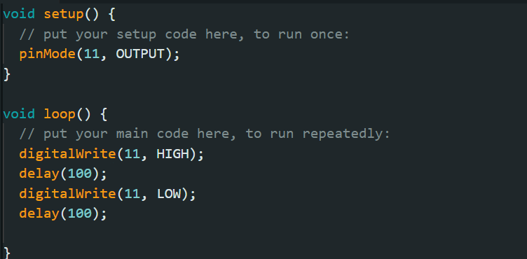
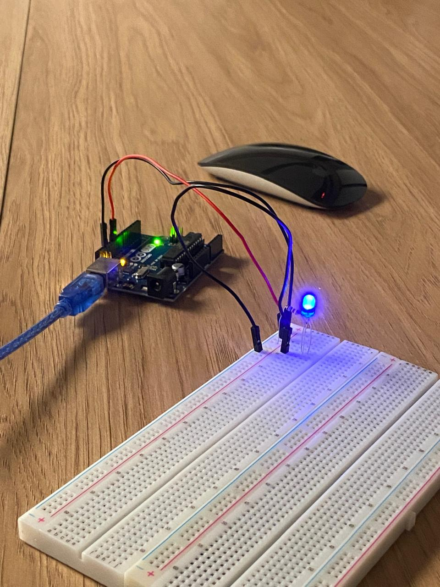

# Primeiras interações com arduino:

## Ponderada 01 

### item 01 - blink(Hello world do arduino)

O primeiro desafio que foi proposto foi o blink do arduino, ele é o equivalente ao hello world só que para a programação do microprocessador.

**Segue imagem do código e do led ligado.**

  
   
  <em>Código Blink no Arduino</em>
  
   `pinMode(11, output)` = Aqui o pino 11 é configurado como saída (OUTPUT), ou seja, ele vai enviar corrente elétrica.

   `` digitalWrite(11)`` = coloca ou tira tensão do pino, assim ligando ou apagando o led.

   ``delay()`` = coloca um tempo de espera antes de rodar o código seguinte.

  
   
  <em>Arduino com a luz ligada</em>

### Item 02 - Blink externo

Agora, com o blink feito no led do arduino, vamos passar para fora do mesmo.

Inicialmente vamos começar fazendo o projeto do circuito no tinkercad para garantir que nada queime !.

**Abaixo segue a imagem do circuito**

  
   
  <em>Circuito simplificado</em>

  
   
  <em>Circuito estilizado</em>

Com o projeto feito e sem erros, montamos o mesmo circuito no protoboard

**Os materiais utilizados foram:**
- 1 arduino uno 
- 1 resistor de 1000ohm 
- 1 led  
- 3 jumpers

**Abaixo segue o código e a foto da placa**

  
   
  <em>Código da placa externa</em>

   `pinMode(11, output)` = Aqui o pino 11 é configurado como saída (OUTPUT), ou seja, ele vai enviar corrente elétrica.

   `` digitalWrite(11)`` = coloca ou tira tensão do pino, assim ligando ou apagando o led.

   ``delay()`` = coloca um tempo de espera antes de rodar o código seguinte.

  
   
  <em>Placa com led ligado</em>

### Conclusão

Com esse projeto, foi possivel absorver os conceitos iniciais do arduino e as possibilidades que sua utilização traz, portanto, esse projeto de blinker foi uma porta de entrada para um mundo de oportunidades.
