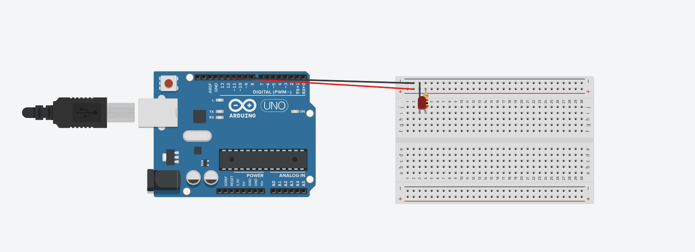

# Primeiras interações com arduino:

## Ponderada 01 

### item 01 - blink(Hello world do arduino)

O primeiro desafio que foi proposto foi o blink do arduino, ele é o equivalente ao hello world só que para a programação do microprocessador.

**Segue imagem do código e do led ligado.**

  
   
  <em>Código Blink no Arduino</em>

  
   
  <em>Arduino com a luz ligada</em>

### Item 02 - Blink externo

Agora, com o blink feito no led do arduino, vamos passar para fora do mesmo.

Inicialmente vamos começar fazendo o projeto do circuito no tinkercad para garantir que nada queime !.
**Abaixo segue a imagem do circuito**

  
   
  <em>Circuito simplificado</em>

  
   
  <em>Circuito estilizado</em>

